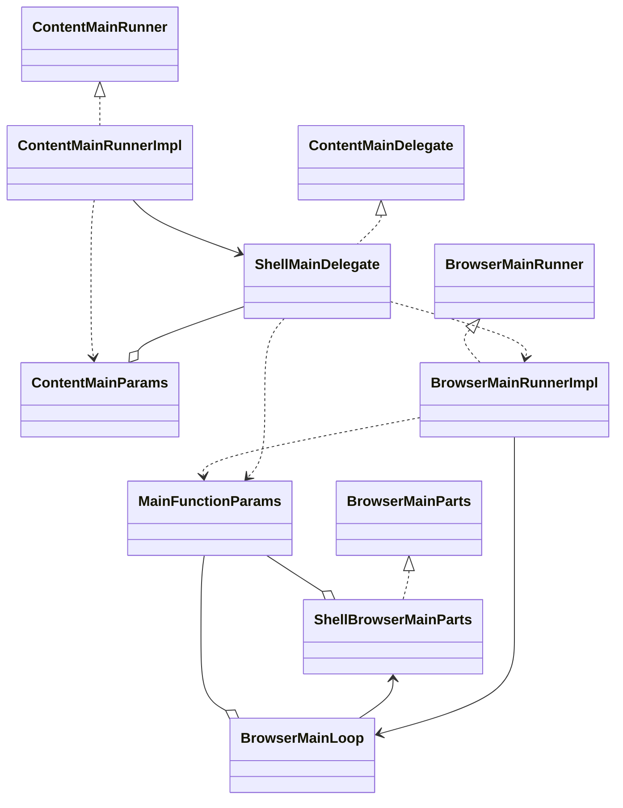
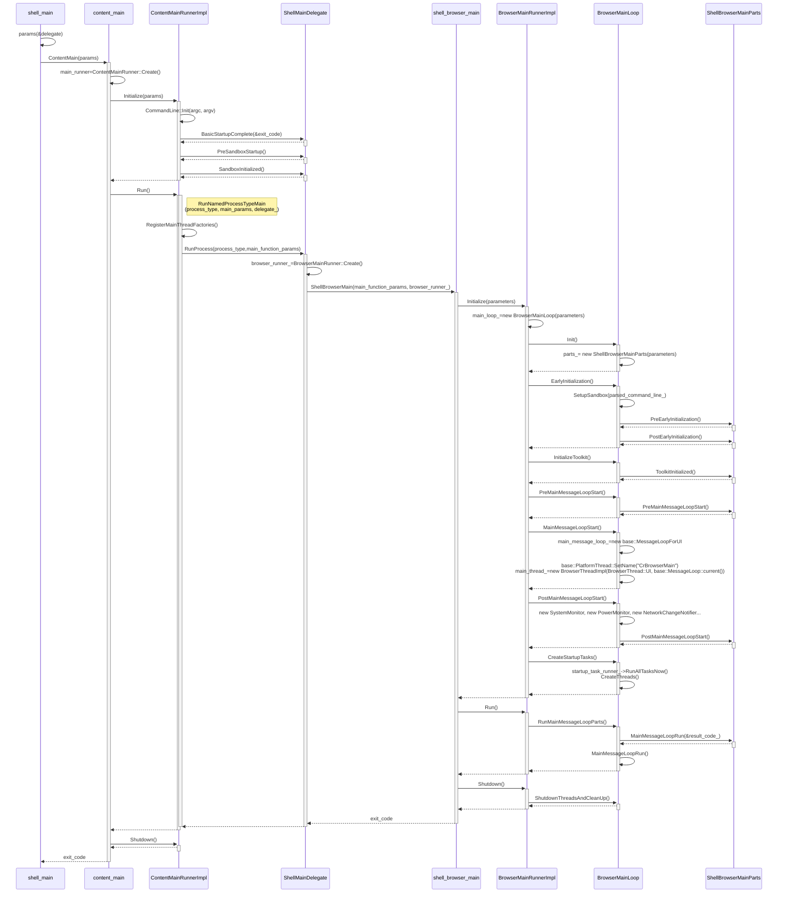

```shell
子进程调试方法：
                   set args --no-sandbox
                   
                   base::LaunchProcess                     b launch_posix.cc:294
                   ChildProcessLauncher::Launch            b ChildProcessLauncher::Launch                      
                   content::BrowserMainRunnerImpl::Initialize 
                   b BrowserMainLoop::Init
                   b BrowserMainLoop::EarlyInitialization             
                   ./content_shell --renderer-cmd-prefix='gnome-terminal -- cgdb --args'    //后台运行子进程 "./content_shell --type=renderer ..."  由 gnome-terminal -- cgdb --args ./content_shell --type=renderer ...代替，正好可以调试
                   ./content_shell --utility-cmd-prefix='gnome-terminal -- cgdb --args'
                   ./content_shell --gpu-launcher='gnome-terminal -- cgdb --args'
                   ./content_shell --no-sandbox --zygote-cmd-prefix='gnome-terminal -- cgdb --args' //沙箱可能会干扰内部symbolizer,所以关掉
```





```c++
content/shell/app/shell_main.cc 入口main函数
  content::ShellMainDelegate delegate;
  //content::ContentMainParams params的作用就是把argc，argv，delegate保存起来塞给ContentMain
  content::ContentMainParams params(&delegate);
  params.argc = argc;
  params.argv = argv; 
  return content::ContentMain(params);


ContentMainDelegate类是一个抽象基类，提供了一系列虚函数，供嵌入者（如浏览器或其他内容应用程序）实现其特定的启动和处理逻辑。以下是每个函数的具体作用，参照注释进行详细说明：
1. BasicStartupComplete(int* exit_code)
	通知嵌入者基本的启动过程已经完成，此时可以安全地创建单例对象并检查命令行参数。
	如果返回 true，表示进程应该退出，并且 exit_code 应该被设置为退出代码。
	这是嵌入者在启动时执行必要操作的地方，通常在此函数中进行一些初始化工作。
2. PreSandboxStartup()
	允许嵌入者在沙箱（sandbox）初始化之前执行启动代码。
	这个函数的默认实现为空，嵌入者可以选择重写它以添加特定的初始化逻辑。
3. SandboxInitialized(const std::string& process_type)
	在沙箱初始化后调用，允许嵌入者添加启动代码。
	这个函数可以用于执行与特定进程类型相关的初始化操作。
4. RunProcess(const std::string& process_type, const MainFunctionParams& main_function_params)
	请求嵌入者启动一个特定类型的进程。
	返回 -1 表示使用默认行为，嵌入者可以根据需要实现自定义的进程启动逻辑。
5. ProcessExiting(const std::string& process_type)
	在进程退出之前调用，允许嵌入者执行清理操作。
	这个函数可以用于释放资源或保存状态等。
6. ZygoteStarting(ScopedVector<ZygoteForkDelegate>* delegates)
	通知嵌入者 zygote 进程即将启动，允许嵌入者指定一个或多个 zygote 委托。
	嵌入者可以通过 delegates 参数存储自定义的 zygote 委托，以便在 zygote 进程中使用。
7. ZygoteForked()
	每次 zygote 进程分叉时调用，允许嵌入者执行与分叉相关的操作。
	这个函数的默认实现为空，嵌入者可以选择重写它以添加特定的逻辑。
8. ShouldEnableProfilerRecording()
	返回是否应该启用性能分析记录。
	这个函数的具体实现可能与调试或性能监控相关。
9. CreateContentBrowserClient(), CreateContentGpuClient(), CreateContentRendererClient(), CreateContentUtilityClient()
	这些函数允许嵌入者为不同的内容类型创建相应的客户端（浏览器、GPU、渲染器和工具客户端）。
	如果嵌入者希望使用默认的空实现，可以不重写这些函数。


content/app/content_main.cc 入口ContentMain函数
ContentMainRunner* main_runner = new ContentMainRunnerImpl();
main_runner->Initialize(params);
main_runner->Run();
main_runner->Shutdown();


//Initialize 函数负责设置和初始化内容主程序的各种组件，包括命令行参数解析、信号处理、IPC 通道、内存管理、跟踪记录、V8 引擎的初始化等。
//它还允许嵌入者在特定的初始化阶段插入自定义逻辑。这个函数是内容主程序启动过程中的关键部分。
  int Initialize(const ContentMainParams& params) override {
    ui_task_ = params.ui_task; //由browser_tests使用。如果非null，则BrowserMain将此任务安排在MessageLoop上运行。它属于测试代码。
    base::EnableTerminationOnOutOfMemory(); //这样做是为了确保在进程初始化期间发生的OOM（Out Of Memory，内存不足）错误能够正确地向操作系统发出信号。
    
    base::GlobalDescriptors说明：
在执行子进程之前，通常会将文件描述符安装到已知的槽号中。Stdin、stdout和stderr都是这样的例子。
然而，当使用zygote模型时，这就变得很麻烦。由于需要在这些位置中的描述符通常是未知的，任何代码都可以打开一个资源并获取其中的一个描述符。简单地覆盖插槽不是一个可行的解决方案。
我们可以尝试尽快填满预留的位置，但这是一个脆弱的解决方案，因为全局构造函数等能够打开文件。
相反，我们放弃在特定槽中安装描述符的想法，而是以这个单例对象的形式添加一个间接层。它将抽象键映射到描述符。如果每个独立的模块都需要定义键，那么应该随机选择值，以免发生冲突。
    base::GlobalDescriptors* g_fds = base::GlobalDescriptors::GetInstance(); //base::GlobalDescriptors* g_fds = new base::GlobalDescriptors();
    setlocale(LC_ALL, "");//设置C库locale设置，以确保CommandLine可以以正确的编码解析参数值。
    SetupSignalHandlers(); //设置signal-handling状态:重新初始化大多数信号，忽略SIGPIPE。
    g_fds->Set(kPrimaryIPCChannel, kPrimaryIPCChannel + base::GlobalDescriptors::kBaseDescriptor); //set key=0 => fd=3
    g_fds->Set(kMojoIPCChannel,kMojoIPCChannel + base::GlobalDescriptors::kBaseDescriptor);  //set key=4 => fd=7
    g_fds->Set(kCrashDumpSignal, kCrashDumpSignal + base::GlobalDescriptors::kBaseDescriptor);  //set key=2 => fd=5
    
    is_initialized_ = true; //将 is_initialized_ 标记为 true，表示初始化过程已开始。
    delegate_ = params.delegate; //将传入的 delegate 赋值给成员变量 delegate_，用于后续的委托调用。
    //退出管理器exit_manager_负责调用Singleton对象的dtors。
    //如果 ui_task_ 为空，则创建一个新的 AtExitManager 实例，用于在程序退出时调用单例对象的析构函数。
    if (!ui_task_) {
        //在运行浏览器测试时，不要创建第二个AtExitManager，因为在ContentMain调用之前创建的对象在返回时被销毁，这会干扰shutdown。
    	exit_manager_.reset(new base::AtExitManager);
    } 
    int argc = 0;
    const char** argv = NULL; 
    argc = params.argc; 
    argv = params.argv;
    base::CommandLine::Init(argc, argv); //解析command line
    base::EnableTerminationOnHeapCorruption(); //启用堆损坏时的终止机制，确保在堆损坏时程序能够安全退出
    //在命令行初始化后立即启用分析器记录，以便监控浏览器启动。如果存在委托并且允许启用性能分析记录，则启用跟踪器。
    if (delegate_ && delegate_->ShouldEnableProfilerRecording())
    
    SetProcessTitleFromCommandLine(argv); //设置进程title
    int exit_code = 0;
    //调用delegate的 BasicStartupComplete 方法
    if (delegate_ && delegate_->BasicStartupComplete(&exit_code)) //启动完整了就退出浏览器init
	return exit_code;

    completed_basic_startup_ = true; //标记基本启动过程已完成。
    const base::CommandLine& command_line = *base::CommandLine::ForCurrentProcess();
    std::string process_type = command_line.GetSwitchValueASCII(switches::kProcessType); //获取commandline里--type=参数
    
    InitializeMojo(); //初始化mojo，以便可以注册服务。
    
    //ContentClient 是一个接口类，它定义了与内容（Content）相关的一些回调和功能。具体来说，ContentClient 提供了一个接口，
    //允许浏览器的不同部分（比如渲染进程）与内容相关的操作进行通信。
    if (!GetContentClient())
      SetContentClient(&empty_content_client_);
    ContentClient函数主要初始化了如下成员变量
	browser_: 创建类型为ChromeContentBrowserClient， 用于和browser 进程交互。（只有browser进程里面有）
	gpu_：创建类型为ChromeContentGpuClient。只存在与gpu进程中。
	chrome_content_utility_client_：创建类型为ChromeContentUtilityClient。只存在Utility进程中。
	renderer_：创建类型为ChromeContentRendererClient。 只存在render进程中。 
    ContentClientInitializer::Set(process_type, delegate_); //新建content_client
    
    //尽早启用启动跟踪，以避免忽略早期的TRACE_EVENT调用。对于Android，启动跟踪是在更早的位置ibrary_loader_hooks.cc中启用的。
    //tracing::TraceConfigFile::GetInstance()->IsEnabled()没有使能，不会运行这个代码
    if (command_line.HasSwitch(switches::kTraceStartup)) { //检查命令行中是否包含启动跟踪的开关。
      base::trace_event::TraceConfig trace_config(
          command_line.GetSwitchValueASCII(switches::kTraceStartup),
          base::trace_event::RECORD_UNTIL_FULL); //创建跟踪配置，设置为“记录直到满”。
      base::trace_event::TraceLog::GetInstance()->SetEnabled(
          trace_config,
          base::trace_event::TraceLog::RECORDING_MODE); //启用跟踪日志记录。
    } else if (command_line.HasSwitch(switches::kTraceToConsole)) { //检查命令行中是否包含将跟踪输出到控制台的开关。
      base::trace_event::TraceConfig trace_config =
          tracing::GetConfigForTraceToConsole(); //获取用于控制台跟踪的配置。
      LOG(ERROR) << "Start " << switches::kTraceToConsole
                 << " with CategoryFilter '"
                 << trace_config.ToCategoryFilterString() << "'."; //记录错误日志，指示控制台跟踪的启动。
      base::trace_event::TraceLog::GetInstance()->SetEnabled(
          trace_config,
          base::trace_event::TraceLog::RECORDING_MODE);
    } else if (process_type != switches::kZygoteProcess &&
               process_type != switches::kRendererProcess) { //检查当前进程类型是否不是 zygote 进程或渲染进程。
      if (tracing::TraceConfigFile::GetInstance()->IsEnabled()) { //检查跟踪配置文件是否启用。
        // This checks kTraceConfigFile switch.
        base::trace_event::TraceLog::GetInstance()->SetEnabled(
            tracing::TraceConfigFile::GetInstance()->GetTraceConfig(),
            base::trace_event::TraceLog::RECORDING_MODE);
      }
    }
    
    TRACE_EVENT0("startup,benchmark", "ContentMainRunnerImpl::Initialize"); //记录一个跟踪事件，标记初始化过程的开始。
    
    //Android追踪在这个函数开始时就开始了。其他操作系统必须等到我们到达这里，才能完成所有的内存管理设置。
    //检查分配器是否已初始化，确保内存管理正常工作。
    CHECK(base::allocator::IsAllocatorInitialized());

    if (!process_type.empty()) { //不是主进程,主进程--type=""参数
      if (!base::debug::BeingDebugged()) //进程在GDB状态下
        signal(SIGINT, SIG_IGN); //运行时忽略 Ctrl+C 产生的 SIGINT 信号，进程不会因为用户按下 Ctrl+C 而被终止
    }
    证书~/.pki/nssdb
    crypto::EarlySetupForNSSInit(); //如果使用 NSS 证书，则进行早期的 NSS 初始化设置。
    
    ui::RegisterPathProvider(); //注册路径提供程序，用于管理文件路径。
    RegisterPathProvider(); //再次注册路径提供程序，可能是为了确保所有路径都被正确管理。
    RegisterContentSchemes(true); //注册内容方案，允许程序识别和处理特定的 URL 方案。
    
    //读取./icudtl.dat
    CHECK(base::i18n::InitializeICU()); //检查 ICU（国际化组件库）是否已成功初始化。
    
    base::StatisticsRecorder::Initialize();  //初始化统计记录器，用于收集和记录程序运行时的统计信息。
    
    如果使用外部启动数据，则编译以下代码。
    #if defined(V8_USE_EXTERNAL_STARTUP_DATA)
    从command line里--v8-natives-passed-by-fd=...
    if (command_line.HasSwitch(switches::kV8NativesPassedByFD)) { //检查命令行中是否包含通过文件描述符传递 V8 原生数据的开关。
        g_fds->Set(
          kV8NativesDataDescriptor,
          kV8NativesDataDescriptor + base::GlobalDescriptors::kBaseDescriptor); //设置 V8 原生数据的描述符。
    }
    从command line里--v8-snapshot-passed-by-fd=...
    if (command_line.HasSwitch(switches::kV8SnapshotPassedByFD)) { //检查命令行中是否包含通过文件描述符传递 V8 快照数据的开关。
      g_fds->Set(
          kV8SnapshotDataDescriptor,
          kV8SnapshotDataDescriptor + base::GlobalDescriptors::kBaseDescriptor); //设置 V8 快照数据的描述符。
    }
    
    //LoadV8Snapshot, LoadV8Natives
    int v8_natives_fd = g_fds->MaybeGet(kV8NativesDataDescriptor); //获取 V8 原生数据的文件描述符。
    int v8_snapshot_fd = g_fds->MaybeGet(kV8SnapshotDataDescriptor); //获取 V8 快照数据的文件描述符。
    if (v8_snapshot_fd != -1) { // 检查 V8 快照数据的文件描述符是否有效。
      auto v8_snapshot_region = g_fds->GetRegion(kV8SnapshotDataDescriptor); //获取 V8 快照数据的内存区域。
      gin::V8Initializer::LoadV8SnapshotFromFD(
          v8_snapshot_fd, v8_snapshot_region.offset, v8_snapshot_region.size); //从文件描述符加载 V8 快照数据。
    } else {
      gin::V8Initializer::LoadV8Snapshot(); //如果快照文件描述符无效，则从默认位置加载 V8 快照数据。
    }
    if (v8_natives_fd != -1) { //检查 V8 原生数据的文件描述符是否有效。
      auto v8_natives_region = g_fds->GetRegion(kV8NativesDataDescriptor); // 获取 V8 原生数据的内存区域。
      gin::V8Initializer::LoadV8NativesFromFD(
          v8_natives_fd, v8_natives_region.offset, v8_natives_region.size); //从文件描述符加载 V8 原生数据。
    } else {
      gin::V8Initializer::LoadV8Natives(); //如果原生数据文件描述符无效，则从默认位置加载 V8 原生数据。
    }
        
    运行ShellMainDelegate::PreSandboxStartup，embedder可以在这里添加启动代码，以便在沙盒初始化后运行。./content_shell.pak
    if (delegate_)
      delegate_->PreSandboxStartup(); //调用delegate其 PreSandboxStartup 方法，允许嵌入者在沙箱初始化之前执行代码。

    if (!process_type.empty()) //如果进程类型非空，则调用 CommonSubprocessInit 方法进行子进程的初始化。
      CommonSubprocessInit(process_type);
    
    //embedder可以在这里添加启动代码，以便在沙盒初始化后运行。  
    if (delegate_)
      delegate_->SandboxInitialized(process_type);
      
      


      
      //Run 函数负责根据命令行参数确定当前进程的类型，并调用相应的主函数进行处理。
      //RunNamedProcessTypeMain 函数则根据进程类型选择合适的主函数，并处理与委托相关的逻辑。
      //这两个函数共同实现了内容主程序的启动和管理，确保不同类型的进程能够正确初始化和运行。
      int Run() override     
	const base::CommandLine& command_line = *base::CommandLine::ForCurrentProcess();
	std::string process_type = command_line.GetSwitchValueASCII(switches::kProcessType);
	
	//在所有子进程上运行此逻辑。Zygotes将在命令行更新后的某个时间点运行这个逻辑。
	std::unique_ptr<base::FieldTrialList> field_trial_list; //声明一个智能指针 field_trial_list，用于管理字段试验列表的生命周期
	
    if (!process_type.empty() && process_type != switches::kZygoteProcess) //不是主进程和Zygote进程
      InitializeFieldTrialAndFeatureList(&field_trial_list); //调用 InitializeFieldTrialAndFeatureList 函数初始化字段试验和特性列表。

    base::HistogramBase::EnableActivityReportHistogram(process_type); //启用活动报告直方图，记录与当前进程类型相关的活动数据。

    MainFunctionParams main_params(command_line); //创建一个 MainFunctionParams 对象 main_params，并将命令行参数传递给它。主要就是把command_line保存下来
    main_params.ui_task = ui_task_;
    return RunNamedProcessTypeMain(process_type, main_params, delegate_); //调用 RunNamedProcessTypeMain 函数，传入进程类型、command_line和delegate
    
    
    
    
    //针对给定的进程类型运行FooMain()如果|process_type|为空，则运行BrowserMain()。返回此进程的退出代码。
    //RunNamedProcessTypeMain 函数的主要功能是根据传入的 process_type 参数来运行相应的主函数（例如 BrowserMain、RendererMain 等）
    //如果传入的 process_type 参数为空字符串（即没有指定特定的进程类型），则默认调用 BrowserMain() 函数。这意味着在没有明确指定进程类型的情况下，程序将启动浏览器主进程。
    //该函数的返回值是当前进程的退出代码。退出代码通常用于指示进程的执行结果，例如成功（通常返回 0）或失败（返回非零值）。调用者可以根据返回的退出代码来判断进程的状态。
    int RunNamedProcessTypeMain(   
    const std::string& process_type, const MainFunctionParams& main_function_params, ContentMainDelegate* delegate)
    
    (gdb) p kMainFunctions
      {{name = 0x9542c47 "",function = 0x44af1a0 <content::BrowserMain(content::MainFunctionParams const\&\)\>\}, 
       {name = 0xa53c096 <switches::kPpapiPluginProcess> "ppapi",function = 0x42e8290 <content::PpapiPluginMain(content::MainFunctionParams const\&\)\>\}, 
       {name = 0xa53c02a <switches::kPpapiBrokerProcess> "ppapi-broker",function = 0x42e7f10 <content::PpapiBrokerMain(content::MainFunctionParams const\&\)\>\}, 
       {name = 0xa53c453 <switches::kUtilityProcess> "utility",function = 0x42dbb70 <content::UtilityMain(content::MainFunctionParams const\&\)\>\}, 
       {name = 0xa53c174 <switches::kRendererProcess> "renderer",function = 0x3905330 <content::RendererMain(content::MainFunctionParams const\&\)\>\}, 
       {name = 0xa53bc6d <switches::kGpuProcess> "gpu-process",function = 0x1bb72f0 <content::GpuMain(content::MainFunctionParams const\&\)\>
    }}
    
   
  //UtilityProcessHostImpl::RegisterUtilityMainThreadFactory(CreateInProcessUtilityThread); //设置全局变量g_utility_main_thread_factory的值=CreateInProcessUtilityThread
  //RenderProcessHostImpl::RegisterRendererMainThreadFactory(CreateInProcessRendererThread); //设置全局变量g_renderer_main_thread_factory的值=CreateInProcessRendererThread
  //GpuProcessHost::RegisterGpuMainThreadFactory(CreateInProcessGpuThread); //设置全局变量g_gpu_main_thread_factory的值=CreateInProcessGpuThread
  RegisterMainThreadFactories(); //注册主线程工厂，用于创建和管理主线程的相关资源。
  
    for (size_t i = 0; i < arraysize(kMainFunctions); ++i) { //遍历 kMainFunctions 数组中的每个元素。
    if (process_type == kMainFunctions[i].name) { //检查当前的 process_type 是否与数组中的某个进程类型匹配。
      if (delegate) {
        int exit_code = delegate->RunProcess(process_type, main_function_params);  //运行shell_browser_main.cc的ShellBrowserMain(),这个函数是作为浏览器进程的主例程。
        if (exit_code >= 0)
          return exit_code;
      }
      return kMainFunctions[i].function(main_function_params); //如果找到了匹配的进程类型，调用对应的主函数并传入主参数，返回其结果。
    }
  }
  //zygote 启动是一个特殊的情况，并提示开发者查看 RunZygote 函数的注释，以了解为什么不直接使用 ZygoteMain。这表明 zygote 进程的启动逻辑与其他进程类型不同，可能涉及特定的初始化步骤或处理。
  if (process_type == switches::kZygoteProcess) //启动参数--type=zygote
    return RunZygote(main_function_params, delegate);
    
  //如果遇到一个未知的进程类型，嵌入者（即使用该框架的应用程序或库）应该知道如何处理这种情况。这表明该框架的设计允许嵌入者自定义或扩展处理逻辑。
  if (delegate)
    return delegate->RunProcess(process_type, main_function_params);
    
  
  int ShellMainDelegate::RunProcess(const std::string& process_type, const MainFunctionParams& main_function_params) {
  if (!process_type.empty()) //只有主进程--type=""进程才可以走下去，否则直接return -1;比如--type="gpu"直接返回了
      return -1;
      
  //因为 BrowserMainRunner 的生命周期与 ShellMainDelegate 的生命周期不同，因此需要使用智能指针来管理其内存。
  //声明一个 std::unique_ptr 类型的指针 browser_runner_，用于管理 BrowserMainRunner 实例的生命周期。使用智能指针可以自动释放内存，避免内存泄漏。
  std::unique_ptr<BrowserMainRunner> browser_runner_;

  base::trace_event::TraceLog::GetInstance()->SetProcessName("Browser"); //设置当前进程的名称为 "Browser"，这通常用于性能跟踪和调试，以便在跟踪日志中清晰地标识出该进程。
  //设置当前进程的排序索引为 kTraceEventBrowserProcessSortIndex。这可能用于在跟踪日志中对进程进行排序，以便更好地组织和分析事件。
  base::trace_event::TraceLog::GetInstance()->SetProcessSortIndex(kTraceEventBrowserProcessSortIndex); 
  
  //创建一个新的 BrowserMainRunner 实例，并将其指针赋值给 browser_runner_。reset 方法会释放之前指向的对象（如果有的话），并将 browser_runner_ 指向新创建的对象。
  browser_runner_.reset(BrowserMainRunner::Create());
  base::CommandLine& command_line = *base::CommandLine::ForCurrentProcess();
  // 检查命令行参数中是否包含 --run-layout-test 或 --check-layout-test-sys-deps 这两个开关。如果任一开关存在，则执行布局测试相关的主函数
  return command_line.HasSwitch(switches::kRunLayoutTest) ||
                 command_line.HasSwitch(switches::kCheckLayoutTestSysDeps)
             ? LayoutTestBrowserMain(main_function_params, browser_runner_)  //--run-layout-test 或 --check-layout-test-sys-deps执行LayoutTestBrowserMain
             : ShellBrowserMain(main_function_params, browser_runner_);  //不是测试参数，那执行ShellBrowserMain
}
    
    
content/shell/browser/shell_browser_main.cc    
// ShellBrowserMain 函数是作为浏览器进程运行的主要例程。它负责初始化和运行浏览器的主逻辑。
int ShellBrowserMain(const content::MainFunctionParams& parameters, const std::unique_ptr<content::BrowserMainRunner>& main_runner) {
  int exit_code = main_runner->Initialize(parameters);
  if (exit_code >= 0)
    return exit_code;
  exit_code = main_runner->Run();
  main_runner->Shutdown();
  return exit_code;
}


content/browser/browser_main_runner.cc  
Initialize 函数负责浏览器的初始化过程，包括设置线程上下文、初始化图形库、创建和初始化主循环、处理输入法等。
注释清晰地解释了每个步骤的目的和注意事项，确保在 Android 平台上能够正确地初始化浏览器并处理潜在的多次初始化请求。通过使用 UMA 直方图，函数还能够收集性能数据以供后续分析。
  int Initialize(const MainFunctionParams& parameters) override {
    //开始一个长时间的 UMA（用户行为分析）直方图计时器，用于记录 BrowserMainRunnerImplInitialize 的初始化时间。这有助于性能分析和监控启动时间。
    SCOPED_UMA_HISTOGRAM_LONG_TIMER("Startup.BrowserMainRunnerImplInitializeLongTime");

    // TODO(vadimt, yiyaoliu): Remove all tracked_objects references below once
    // crbug.com/453640 is fixed.
    //在某个问题（crbug.com/453640）修复后，将移除以下代码中对 tracked_objects 的所有引用。这表明当前代码依赖于某个尚未解决的问题。
    tracked_objects::ThreadData::InitializeThreadContext(kMainThreadName); //初始化当前线程的上下文，设置线程名称为 kMainThreadName。这有助于跟踪和调试。
    base::trace_event::AllocationContextTracker::SetCurrentThreadName(kMainThreadName); // 设置当前线程的名称，以便在跟踪事件中清晰地标识该线程。
    TRACK_SCOPED_REGION("Startup", "BrowserMainRunnerImpl::Initialize"); //开始一个跟踪区域，用于记录 BrowserMainRunnerImpl::Initialize 的执行时间。这有助于性能分析。
    TRACE_EVENT0("startup", "BrowserMainRunnerImpl::Initialize"); //记录一个跟踪事件，标记 BrowserMainRunnerImpl::Initialize 的开始。这有助于在性能分析工具中查看该函数的执行情况。

    // On Android we normally initialize the browser in a series of UI thread
    // tasks. While this is happening a second request can come from the OS or
    // another application to start the browser. If this happens then we must
    // not run these parts of initialization twice.
    //在 Android 上，浏览器通常在一系列 UI 线程任务中初始化。如果在此过程中收到来自操作系统或其他应用程序的第二个请求启动浏览器，则必须避免重复运行初始化的某些部分。
    if (!initialization_started_) {
      initialization_started_ = true; //将 initialization_started_ 标志设置为 true，表示初始化过程已经开始。

      const base::TimeTicks start_time_step1 = base::TimeTicks::Now(); //记录当前时间，用于计算初始化步骤 1 的持续时间。

      SkGraphics::Init(); //初始化 Skia 图形库，这是一个用于 2D 图形渲染的库。
      //检查命令行参数中是否包含 --wait-for-debugger 开关。如果存在，则调用 WaitForDebugger 方法，等待调试器连接，最多等待 60 秒。
      if (parameters.command_line.HasSwitch(switches::kWaitForDebugger))
        base::debug::WaitForDebugger(60, true); 

      base::StatisticsRecorder::Initialize(); //初始化统计记录器，用于收集和记录应用程序的统计数据

      notification_service_.reset(new NotificationServiceImpl); //创建一个新的 NotificationServiceImpl 实例，并将其指针赋值给 notification_service_，用于处理通知服务。

      main_loop_.reset(new BrowserMainLoop(parameters)); //创建一个新的 BrowserMainLoop 实例，并将其指针赋值给 main_loop_，用于管理浏览器的主循环。

      main_loop_->Init(); //执行主循环的初始化操作。

      main_loop_->EarlyInitialization(); //执行早期初始化操作。

      // Must happen before we try to use a message loop or display any UI.
      //确保在使用消息循环或显示任何 UI 之前，调用 main_loop_ 的 InitializeToolkit 方法进行工具包初始化。如果初始化失败，则返回 1，表示错误。
      if (!main_loop_->InitializeToolkit()) //平台界面系统的初始化工作
        return 1;

      main_loop_->PreMainMessageLoopStart(); //执行主消息循环开始前的操作，只调用parts_->PreMainMessageLoopStart()，他里面只有一句ui::TouchFactory::SetTouchDeviceListFromCommandLine() 
      //开始主消息循环,初始化main_message_loop_和主线程CrBrowserMain。
      //main_message_loop_=new base::MessageLoopForUI(),
      //InitializeMainThread()里main_thread_ = new BrowserThreadImpl(BrowserThread::UI, base::MessageLoop::current()));
      main_loop_->MainMessageLoopStart(); 
       
      main_loop_->PostMainMessageLoopStart(); //执行主消息循环开始后的操作。

	// WARNING: If we get a WM_ENDSESSION, objects created on the stack here
	// are NOT deleted. If you need something to run during WM_ENDSESSION add it
	// to browser_shutdown::Shutdown or BrowserProcess::EndSession.
	//注释警告，如果接收到 WM_ENDSESSION 消息，这里创建的栈对象不会被删除。
	//如果需要在 WM_ENDSESSION 时执行某些操作，应将其添加到 browser_shutdown::Shutdown 或 BrowserProcess::EndSession 中。

      ui::InitializeInputMethod(); //初始化输入法系统，以便支持文本输入
      //记录初始化步骤 1 的持续时间到 UMA 直方图中，以便进行性能分析。
      UMA_HISTOGRAM_TIMES("Startup.BrowserMainRunnerImplInitializeStep1Time", base::TimeTicks::Now() - start_time_step1); 
    }
    const base::TimeTicks start_time_step2 = base::TimeTicks::Now(); //记录当前时间，用于计算初始化步骤 2 的持续时间。
    main_loop_->CreateStartupTasks(); //创建启动任务。最终是调用BrowserMainLoop的CreateThreads函数：初始化DB thread、IO thread、File thread、Cache thread等
    int result_code = main_loop_->GetResultCode(); //获取主循环的结果代码，存储在 result_code 中。
    if (result_code > 0)
      return result_code;

    //记录初始化步骤 2 的持续时间到 UMA 直方图中，以便进行性能分析。
    UMA_HISTOGRAM_TIMES("Startup.BrowserMainRunnerImplInitializeStep2Time", base::TimeTicks::Now() - start_time_step2);

    // Return -1 to indicate no early termination. 返回 -1，表示没有早期终止，初始化成功完成。
    return -1;
  }


  content/browser/browser_main_loop.cc
  void BrowserMainLoop::Init() {
       //其实是运行ShellContentBrowserClient::CreateBrowserMainParts(),代码在content/shell/browser/shell_content_browser_client.cc:160
       //等效于parts_ = new ShellBrowserMainParts(parameters);
      parts_.reset(GetContentClient()->browser()->CreateBrowserMainParts(parameters_));
  }
 
 //BrowserMainLoop::EarlyInitialization 函数负责浏览器主循环的早期初始化，包括设置沙箱、初始化图形库、配置 GLib、调整文件描述符限制、初始化 NSPR 和设置渲染进程限制等。
 //注释清晰地解释了每个步骤的目的和注意事项，确保在启动浏览器时能够正确地进行必要的初始化操作。
 void BrowserMainLoop::EarlyInitialization() {
  TRACE_EVENT0("startup", "BrowserMainLoop::EarlyInitialization");

  //在调用 SetupSandbox() 之前不应创建任何线程，因为 SetupSandbox() 将使用 fork()，这可能导致问题
  SetupSandbox(parsed_command_line_); //用于设置沙箱环境,在CreateZygote会fork出content_shell --type=zygote...,还有主程序的参数也附加到后面

  if (UsingInProcessGpu()) { //使用进程内GPU, 使用--single-process或者--in-process-gpu参数就认为是进程内GPU
    if (!gfx::InitializeThreadedX11()) { //初始化 X11 的线程模式
      LOG(ERROR) << "Failed to put Xlib into threaded mode.";
    }
  }

  g_type_init(); // GLib 类型系统初始化
  SetUpGLibLogHandler(); //设置 GLib 的日志处理程序，以便正确处理日志消息

  //执行早期初始化的额外步骤,实际跳转到ShellBrowserMainParts::PreEarlyInitialization，
  //函数里只调用ui::InitializeInputMethodForTesting()函数
  if (parts_)
    parts_->PreEarlyInitialization(); 

  // 在 Linux 上，默认的文件描述符软限制因发行版而异，但在 Fedora 上为 1024。
  //由于文件描述符的广泛使用，用户可能会轻易达到此限制，因此将限制提高到 8192，以避免问题
  base::SetFdLimit(8192);

  //需要确保在主线程上初始化 NSPR（网络安全服务库）。调用 crypto::EnsureNSPRInit() 进行初始化.
  crypto::EnsureNSPRInit();

  //检查命令行参数中是否包含 --renderer-process-limit 开关。如果存在，则获取其值并将其转换为 size_t 类型的 process_limit。
  //如果转换成功，则调用 RenderProcessHost::SetMaxRendererProcessCount(process_limit) 设置最大渲染进程数
  if (parsed_command_line_.HasSwitch(switches::kRendererProcessLimit)) {
    std::string limit_string = parsed_command_line_.GetSwitchValueASCII(switches::kRendererProcessLimit);
    size_t process_limit;
    if (base::StringToSizeT(limit_string, &process_limit)) {
      RenderProcessHost::SetMaxRendererProcessCount(process_limit);
    }
  }

  if (parts_)
    parts_->PostEarlyInitialization(); //执行早期初始化后的额外步骤,实际调用BrowserMainParts::PostEarlyInitialization(),是空函数
}
```
