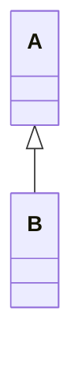
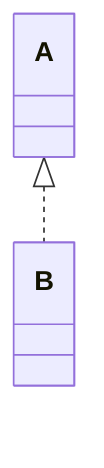
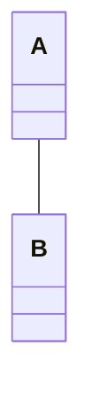
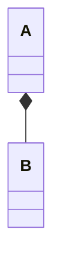
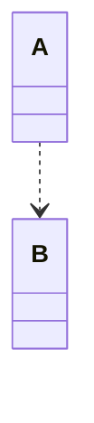

UML类图中包含**‌六种核心关系**‌，具体定义及表现形式如下：

**一、泛化关系（Generalization）**
* ‌定义‌：表示类之间的继承关系（父类与子类），逻辑上为“is a”关系‌。
* 代码体现‌：通过extends关键字实现继承。
* ‌UML符号‌：带空心箭头的实线，箭头指向父类。
* ‌示例‌：Dog继承Animal，表示为Dog → Animal‌。
* ‌关系‌：B 继承自 A（B 是 A 的子类）
* ‌UML符号‌：空心箭头实线（箭头指向父类） A <|-- B
```C++
class A {
  public:
    void func() { /* ... */ }
};
class B : public A {  // B继承A
  public:
    void specificFunc() { /* ... */ }
};
```


**二、实现关系（Realization）**
* ‌定义‌：表示类对接口或抽象类的实现，逻辑上为“is a”关系‌。
* ‌代码体现‌：通过implements关键字实现接口。
* ‌UML符号‌：带空心箭头的虚线，箭头指向接口或抽象类。
* ‌示例‌：Car类实现Vehicle接口，表示为Car ⤍ Vehicle‌。
* ‌关系‌：B 实现接口 A
* ‌UML符号‌：空心箭头虚线（箭头指向接口）A <|.. B
```C++
class A {  // 接口（纯虚类）
  public:
    virtual void pureVirtualFunc() = 0;
};
class B : public A {  // B实现A的接口
  public:
    void pureVirtualFunc() override { /* ... */ }
};
```


**三、关联关系（Association）**
* ‌定义‌：表示类之间的长期、稳定联系，逻辑上为“has a”关系‌。
* ‌代码体现‌：通过成员变量（全局属性）实现。
* ‌UML符号‌：实线（双向关联）或带单向箭头的实线（单向关联）。
* ‌示例‌：Teacher与Student双向关联，表示教师持有学生列表，学生也持有教师列表‌。
* ‌‌关系‌：A 和 B 长期持有对方的对象（双向关联）
* ‌‌UML符号‌：实线 A -- B
```C++
class B;  // 前向声明
class A {
  private:
    B* b_ptr;  // A持有B的指针（长期关联）
  public:
    A(B* b) : b_ptr(b) {}
};
class B {
  private:
    A* a_ptr;  // B持有A的指针（双向关联）
  public:
    B(A* a) : a_ptr(a) {}
};
```


**四、聚合关系（Aggregation）**
* ‌定义‌：一种弱整体-部分关系，部分可脱离整体存在‌。
* ‌代码体现‌：通过成员变量实现，但部分对象独立于整体创建。
* ‌UML符号‌：带空心菱形的实线，菱形指向整体。
* ‌示例‌：School包含多个Teacher，但教师可独立存在‌。
* ‌关系‌：A 包含 B，但 B 可独立存在
* ‌UML符号‌：空心菱形实线（菱形指向整体 A） A o-- B

```C++
class B;  // 前向声明
class A {
  private:
    B* b_ptr;  // A聚合B（B的生命周期由外部管理）
  public:
    A(B* b) : b_ptr(b) {}
    // B对象由外部创建/销毁，A不负责管理
};
class B { /* ... */ };
```


**五、组合关系（Composition）**
* ‌定义‌：一种强整体-部分关系，部分不可脱离整体存在‌。
* ‌代码体现‌：通过成员变量实现，部分对象随整体创建/销毁。
* ‌UML符号‌：带实心菱形的实线，菱形指向整体。
* ‌示例‌：Human包含Heart，心脏不能脱离人体独立存在‌。
* 关系‌：A 包含 B，B 依赖 A 的生命周期
* ‌UML符号‌：实心菱形实线（菱形指向整体 A）A *-- B

```C++
class B;  // 前向声明
class A {
  private:
    B* b_ptr;  // A组合B（B的生命周期由A管理）
  public:
    A() : b_ptr(new B()) {}  // 创建时构造B
    ~A() { delete b_ptr; }   // 销毁时删除B
};
class B { /* ... */ };
```


**六、依赖关系（Dependency）**
* ‌定义‌：临时性使用关系，逻辑上为“use a”关系‌。
* ‌代码体现‌：通过方法参数、局部变量或静态方法调用实现。
* ‌UML符号‌：带单向箭头的虚线，箭头指向被依赖类。
* ‌示例‌：Programmer依赖Computer完成编码任务‌。
* 关系‌：A 临时使用 B
* UML符号‌：虚线箭头（箭头指向被依赖的 B）A ..> B

```C++
class B;  // 前向声明
class A {
  public:
    void useB(B& b) {  // A依赖B（通过方法参数临时使用）
        b.someMethod();
    }
};
class B {
  public:
    void someMethod() { /* ... */ }
};
```


**总结对比表**
|关系类型	|逻辑含义	|UML符号	|生命周期依赖	|典型场景|
|:----:|:----|:----|:----:|:----|
|泛化	|is a	|空心箭头实线	|无	|继承体系|
|实现	|is a	|空心箭头虚线	|无	|接口实现|
|关联	|has a	|实线/箭头	|无	|长期持有对象|
|聚合	|has a	|空心菱形实线	|弱	|整体与可独立部分|
|组合	|has a	|实心菱形实线	|强	|整体与不可分部分|
|依赖	|use a	|虚线箭头	|无	|临时调用|
